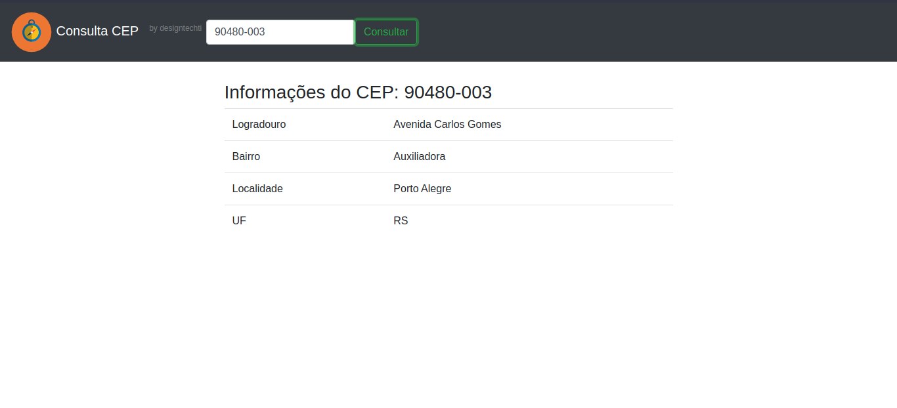

# Consulta de CEP com JQuery e API dos Correios

Este é um projeto simples que demonstra como utilizar o JQuery para realizar consultas de CEP utilizando a API dos Correios. Com essa aplicação, é possível obter informações detalhadas de um endereço a partir do seu CEP.

## Pré-requisitos

- Navegador web moderno
- Conexão com a internet

## Como utilizar

1. Faça o clone ou download deste repositório para o seu ambiente local.
2. Abra o arquivo `index.html` em um navegador web.
3. Insira o CEP no campo de busca.
4. Clique no botão "Consultar".
5. Aguarde a resposta da API dos Correios.
6. Os dados do endereço correspondente ao CEP serão exibidos na tabela.

## Tecnologias utilizadas

&nbsp;
&nbsp;
&nbsp;
&nbsp;
&nbsp;
&nbsp;

## Estrutura do projeto

O projeto possui a seguinte estrutura de arquivos:

- `index.html`: Página HTML que contém o formulário de busca.
- `assets/css`: Arquivos CSS para estilização da página com Bootstrap.
- `assets/js`: Arquivos JavaScript que contém a lógica de consulta do CEP utilizando o JQuery e arquivos do Bootstrap.
- `images/`: Imagens utilizadas no projeto.
- `README.md`: Este arquivo.

## Contribuição

Contribuições são bem-vindas! Se você tiver sugestões, correções de bugs ou melhorias para o projeto, sinta-se à vontade para abrir uma issue ou enviar um pull request.

## Licença

Este projeto está licenciado sob a [MIT License](https://github.com/seu-usuario/seu-repositorio/blob/main/LICENSE).